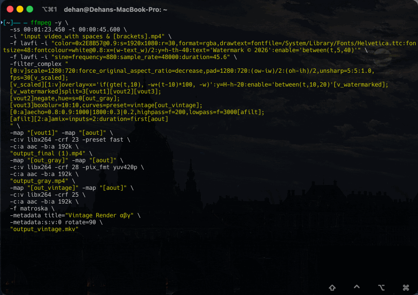

# .config
My personal configuration files for shell, editor, and other tools.

---

## Enhancements

### zsh-easymotion

Jump to any character in your Zsh command line using the [zsh-easymotion](./zsh/zsh-easymotion/zsh-easymotion.zsh)

